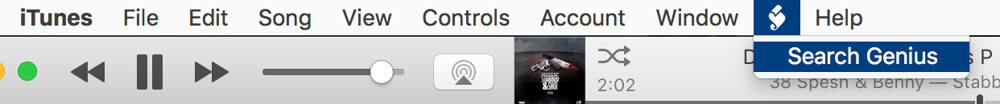

Search Genius.com for current iTunes Track 
===========================================

 

 

### Description

Use this script to find lyrics and liner notes for your current playing track in
iTunes.

 

### How to Use

[1] Place "Search Genius.scptd” in **[username]/Library/iTunes/Scripts**. If
the **Library** folder is hidden press and hold the Option key and select **Go
\> Library** from the Finder. (See
this [article](http://www.macworld.com/article/2057221/how-to-view-the-library-folder-in-mavericks.html) for
more details)

If there is no "Scripts" folder in the **[username]/Library/iTunes/** folder,
create one.

 

[2] Open **iTunes**, click the **Scripts** icon, select **“Search iTunes”**.
That’s it!

